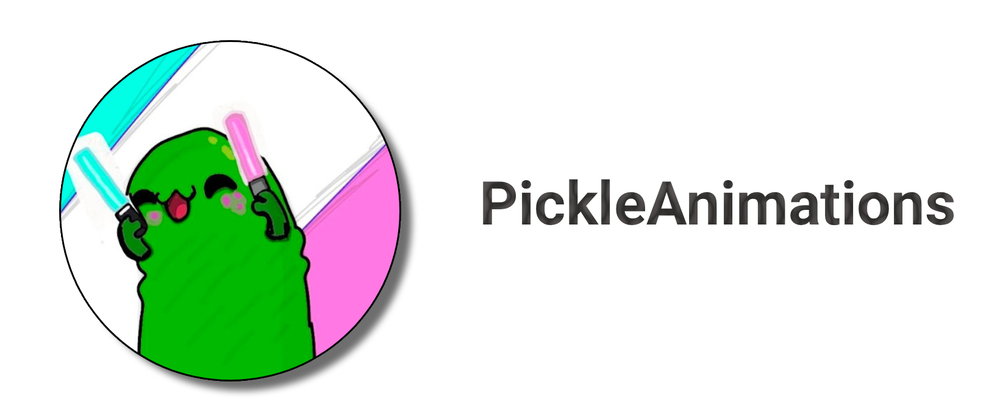

<div align="center">


## A personal website made for my friend

# [Try the website](https://pickle.vaiskiainen.fi)
</div>

## Features

- **Stylish main page** — animated hero section with parallax scrolling, glowing background effects, and a custom cursor
- **Live YouTube data** — fetches subscriber count, channel banner, and latest video uploads via the Invidious API, with fallback to hardcoded values
- **Video section** — horizontally scrolling video carousel with click-to-play in a modal; supports navigating between videos and handles YouTube Shorts
- **Drawings page** — full gallery of Pickle's artwork loaded from `drawings/index.json`, with a preview grid on the home page
- **Socials section** — links to YouTube and Discord
- **Smooth UX touches** — scroll-activated navbar, back-to-top button, intersection observer animations, and smooth scrolling

## Tech stack

Pure HTML, CSS, and vanilla JavaScript

## Project structure

```
index.html          Main page
drawings.html       Full drawings gallery
main.js             All client-side logic
styles.css          All styles
drawings/           Artwork images + index.json manifest
icons/              SVG icons
banner.png          README banner
```

## Running locally

Just serve the directory with any static file server, e.g.:

```bash
npx serve .
# or
python3 -m http.server
```

Then open `http://localhost:3000` (or whichever port).

## How it works

### YouTube / Invidious integration

On page load, `main.js` hits a public Invidious API instance to fetch Pickle's channel data:

- **Subscriber count** — displayed in the hero badge
- **Channel banner** — used as the hero background image
- **Latest videos** — replaces the hardcoded fallback list and re-renders the carousel

If the API request fails (e.g. the instance is down), the site falls back to hardcoded subscriber count and a curated list of videos, so the page is never broken.

### Drawings gallery

Artwork is stored in `drawings/` as PNG files. `drawings/index.json` is a simple array of filenames:

```json
["Pasted image.png", "Pasted image (2).png", ...]
```

`main.js` fetches this manifest on load and renders cards for each image. The home page shows a 4-image preview; `drawings.html` shows the full grid. Images are lazy-loaded so the initial page load stays fast.

### Parallax & animations

All motion is driven by a single `scroll` listener that schedules work via `requestAnimationFrame` to stay off the main thread. Hero content, background glows, and the video carousel track all move at different speeds to create depth. Entry animations use an `IntersectionObserver` to fade/slide elements in once they enter the viewport.

### Custom cursor

On pointer-capable devices (`pointer: fine`), the default cursor is hidden and replaced by a dot + ring pair. The ring follows the dot with lerp smoothing (15% per frame). When hovering a link or button, the dot hides and the ring scales up and fills with a subtle green tint.

## Adding drawings

1. Drop the image file into the `drawings/` directory.
2. Add the filename to `drawings/index.json` (the array is ordered — put new images at the front to show them first).

## Deployment

The site is a static directory, so any host works. The live version is served from [pickle.vaiskiainen.fi](https://pickle.vaiskiainen.fi).

AI was used for this readme